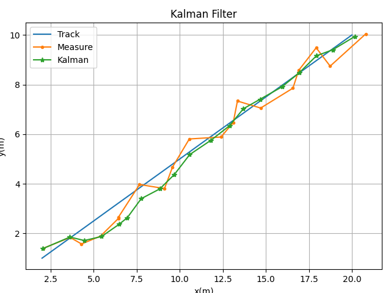
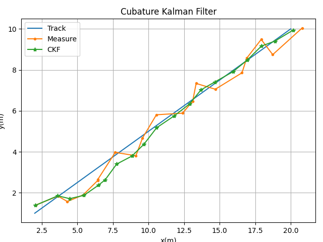

# kalman

## Installation

1. install matrix
```shell
go get -u github.com/mrfyo/kalman
```

2. import it in your code
```go
import "github.com/mrfyo/kalman"
```


## Example

### Linear Kalman Filter

```go
package main

import (
	"fmt"

	"github.com/mrfyo/kalman"
	"github.com/mrfyo/matrix"
)

func main() {
	dimX := 4
	dimZ := 2
	dt := 1.0

	QStd := 0.001
	RStd := 0.4

	F := matrix.Builder().Row().
		Link(1, dt, 0, 0).
		Link(0, 1, 0, 0).
		Link(0, 0, 1, dt).
		Link(0, 0, 0, 1).Build()

	H := matrix.Builder().Row().
		Link(1, 0, 0, 0).
		Link(0, 0, 1, 0).Build()

	X := matrix.Builder().Col().Link(0, 1, 0, 0.5).Build()

	P := matrix.Diag([]float64{10, 4, 10, 4})

	Q := matrix.Builder().Row().
		Link(0.25*math.Pow(dt, 4), 0.5*math.Pow(dt, 3), 0, 0).
		Link(0.5*math.Pow(dt, 3), dt*dt, 0, 0).
		Link(0, 0, 0.25*math.Pow(dt, 4), 0.5*math.Pow(dt, 3)).
		Link(0, 0, 0.5*math.Pow(dt, 3), dt*dt).Build().
		ScaleMul(QStd)

	R := matrix.Eye(dimZ).ScaleMul(RStd * RStd)

	kf := kalman.NewKalmanFilter(dimX, dimZ, dt, F, H)
	kf.Init(X, P, Q, R)

	N := 20
	D := CreateTrack(N, X.GetIndex(0), X.GetIndex(1), X.GetIndex(2), X.GetIndex(3), dt, RStd, QStd)

	for i := 1; i < N; i++ {
		x := D.Get(i, 2)
		y := D.Get(i, 3)
		z := matrix.NewVector([]float64{x, y}, 1)

		kf.Predict()
		X := kf.Update(z)

        fmt.Println(X)
	}
}
```




### Unscented Kalman Filter

```go
func main() {
	dimX := 4
	dimZ := 2
	dt := 1.0

	QStd := 0.001
	RStd := 0.4

	fx := func(dt float64, X matrix.Matrix) matrix.Matrix {
		F := matrix.Builder().Row().
			Link(1, dt, 0, 0).
			Link(0, 1, 0, 0).
			Link(0, 0, 1, dt).
			Link(0, 0, 0, 1).Build()

		return F.Dot(X)
	}

	hx := func(dt float64, X matrix.Matrix) matrix.Matrix {
		H := matrix.Builder().Row().
			Link(1, 0, 0, 0).
			Link(0, 0, 1, 0).Build()

		return H.Dot(X)
	}

	X := matrix.Builder().Col().Link(0, 1, 0, 0.5).Build()

	P := matrix.Diag([]float64{10, 4, 10, 4})

	Q := matrix.Builder().Row().
		Link(0.25*math.Pow(dt, 4), 0.5*math.Pow(dt, 3), 0, 0).
		Link(0.5*math.Pow(dt, 3), dt*dt, 0, 0).
		Link(0, 0, 0.25*math.Pow(dt, 4), 0.5*math.Pow(dt, 3)).
		Link(0, 0, 0.5*math.Pow(dt, 3), dt*dt).Build().
		ScaleMul(QStd)

	R := matrix.Eye(dimZ).ScaleMul(RStd * RStd)

	kf := kalman.NewUnscentedKalmanFilter(dimX, dimZ, dt, fx, hx)
	kf.Init(X, P, Q, R)
}

```


### Cubature Kalman Filter

```go
	// Unscented Kalman Filter Example
	// ...
	kf := kalman.NewCubatureKalmanFilter(dimX, dimZ, dt, fx, hx)
```

